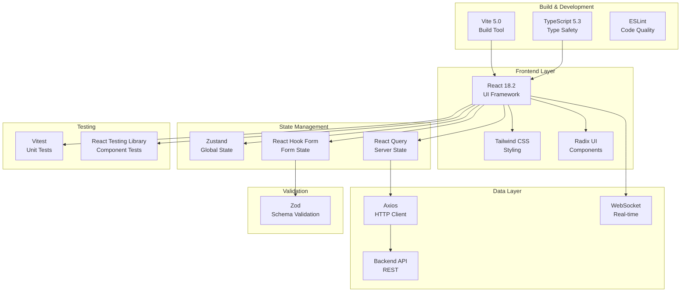
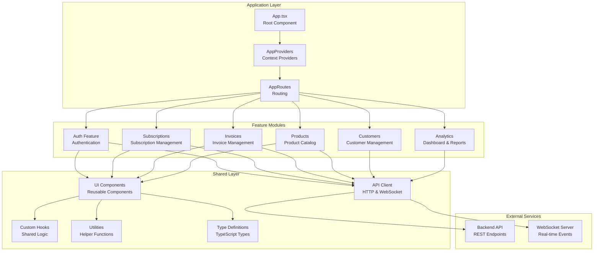
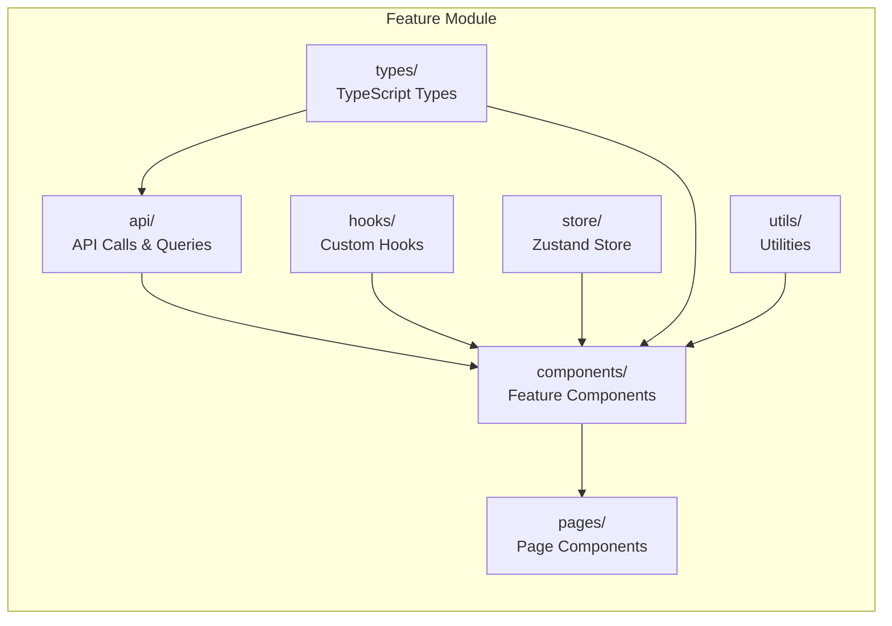
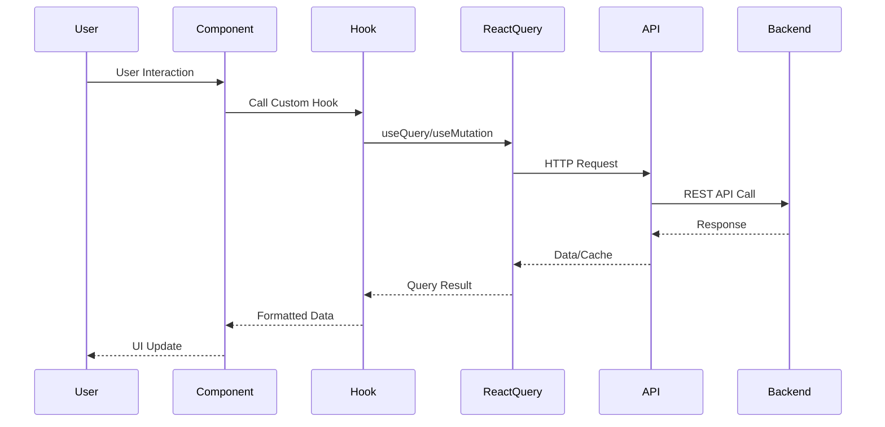

# FluxPay Dashboard

[](https://github.com/YOUR_USERNAME/fluxpay-dashboard/actions/workflows/ci.yml)
[](https://github.com/YOUR_USERNAME/fluxpay-dashboard/actions/workflows/codeql.yml)
[](https://sonarcloud.io/summary/new_code?id=YOUR_USERNAME_fluxpay-dashboard)
[](https://sonarcloud.io/summary/new_code?id=YOUR_USERNAME_fluxpay-dashboard)
[](https://codecov.io/gh/YOUR_USERNAME/fluxpay-dashboard)


[](https://opensource.org/licenses/MIT)

Enterprise-grade subscription management and billing orchestration dashboard for managing subscriptions, invoices, customers, and products.

## 🎯 Purpose

FluxPay Dashboard is a comprehensive SaaS management platform designed to handle the complete lifecycle of subscription-based businesses. It provides real-time analytics, customer management, invoice processing, and product catalog management with enterprise-level security and performance.

## 🛠️ Tech Stack

### Core Technologies
- **Frontend Framework:** React 18.2 - Component-based UI library
- **Language:** TypeScript 5.3 - Type-safe JavaScript
- **Build Tool:** Vite 5.0 - Next-generation frontend tooling
- **Package Manager:** npm

### UI & Styling
- **CSS Framework:** Tailwind CSS 3.4 - Utility-first CSS
- **Component Library:** Radix UI - Unstyled, accessible components
- **Icons:** Material Symbols - Google Material Design icons
- **Charts:** Recharts 2.10 - Composable charting library

### State Management
- **Global State:** Zustand 4.4 - Lightweight state management
- **Server State:** TanStack React Query 5.17 - Data fetching and caching
- **Form State:** React Hook Form 7.48 - Performant form library

### Validation & Forms
- **Validation:** Zod 3.22 - TypeScript-first schema validation
- **Form Resolvers:** @hookform/resolvers - Validation integration

### Testing & Quality
- **Test Framework:** Vitest 1.1 - Fast unit test framework
- **Testing Library:** React Testing Library 14.1 - Component testing
- **Coverage:** @vitest/coverage-v8 - Code coverage reporting
- **Linting:** ESLint 8.55 - Code quality and style checking

### CI/CD & DevOps
- **CI/CD:** GitHub Actions - Automated workflows
- **Security:** CodeQL, Trivy - Vulnerability scanning
- **Quality:** SonarCloud - Code quality analysis
- **Coverage:** Codecov - Coverage tracking

### Tech Stack Architecture



## 🚀 Quick Start

```bash
# Install dependencies
npm install

# Copy environment variables
cp .env.example .env

# Start development server
npm run dev
```

## ⚙️ Environment Variables

The following environment variables need to be configured in your `.env` file:

| Variable | Description | Default |
|----------|-------------|---------|
| `VITE_API_BASE_URL` | Backend API base URL | `http://localhost:8080/api` |
| `VITE_WS_URL` | WebSocket URL for real-time features | `ws://localhost:8080/ws` |
| `VITE_STRIPE_PUBLISHABLE_KEY` | Stripe publishable key for payments | - |
| `VITE_ENVIRONMENT` | Application environment (development/production) | `development` |
| `VITE_CORS_WITH_CREDENTIALS` | Enable CORS with credentials | `false` |
| `VITE_CORS_CREDENTIALS` | CORS credentials mode | `include` |
| `VITE_CORS_MODE` | CORS request mode | `cors` |

**Note:** All environment variables must be prefixed with `VITE_` to be accessible in the application.

## 🏗️ Project Architecture

The project follows a **feature-based modular architecture** that promotes code organization, reusability, and maintainability. Each feature is self-contained with its own API layer, components, state management, and utilities.

### Architecture Overview



### Feature Module Structure

Each feature module follows a consistent structure:



### Data Flow Architecture



### Directory Structure

```
src/
├── app/                    # Application configuration
│   ├── App.tsx             # Root component
│   ├── AppProviders.tsx    # Context providers (React Query, etc.)
│   └── AppRoutes.tsx       # Route definitions
│
├── features/               # Feature modules
│   ├── auth/              # Authentication feature
│   │   ├── api/          # Auth API calls & queries
│   │   ├── components/    # Auth-specific components
│   │   ├── hooks/         # Auth custom hooks
│   │   ├── pages/         # Auth pages (Login, Register, Sessions)
│   │   ├── store/         # Auth state (Zustand)
│   │   ├── types/         # Auth TypeScript types
│   │   └── utils/         # Auth utilities (tokenManager, etc.)
│   │
│   ├── subscriptions/     # Subscription management
│   ├── invoices/          # Invoice management
│   ├── products/          # Product catalog
│   ├── customers/         # Customer management
│   ├── analytics/         # Dashboard & analytics
│   ├── notifications/     # Real-time notifications
│   ├── webhooks/          # Webhook management
│   └── settings/          # Settings
│
└── shared/                 # Shared resources
    ├── api/               # API client & query client
    ├── components/         # Reusable UI components
    │   ├── layout/        # Layout components (Header, Sidebar)
    │   └── ui/            # UI primitives (Button, Input, etc.)
    ├── constants/         # Constants & configuration
    ├── hooks/             # Shared custom hooks
    ├── types/             # Shared TypeScript types
    └── utils/             # Utility functions
```

### Key Architectural Principles

1. **Feature-Based Organization:** Each business feature is self-contained
2. **Separation of Concerns:** Clear boundaries between UI, business logic, and data
3. **Reusability:** Shared components and utilities in `shared/` directory
4. **Type Safety:** Full TypeScript coverage with strict mode
5. **State Management:** Zustand for global state, React Query for server state
6. **API Layer:** Centralized API client with interceptors for auth and error handling

## 📄 License

This project is licensed under the MIT License - see the [LICENSE](LICENSE) file for details.

## 🤝 Contributing

Please read our [Contributing Guidelines](.github/CONTRIBUTING.md) before submitting a pull request.

## 🔒 Security

Please report security vulnerabilities following our [Security Policy](.github/SECURITY.md).
